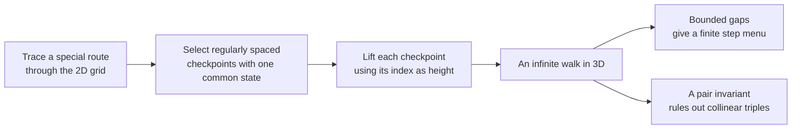
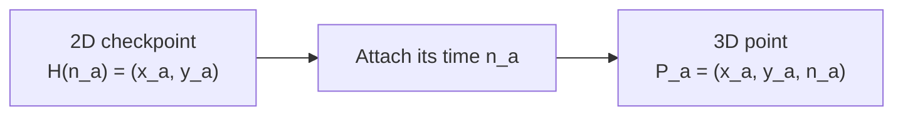

# Erdős 193 — Trace, Select, and Lift

**Previous:** [01 - The Problem in Plain English](01%20-%20The%20Problem%20in%20Plain%20English.md)

## What this note should give you

In [the first lesson](01%20-%20The%20Problem%20in%20Plain%20English.md), we saw that a “no” answer needs one infinite walk that simultaneously has:

1. only finitely many possible step types; and
2. no three distinct visited points on one line.

The construction can be remembered with three verbs:

> **Trace. Select. Lift.**

Do not worry yet about *why* the final anti-collinearity argument works. First understand what object is being built and which part of the construction performs each job.

---

## Step 1: Trace a special route in two dimensions

Start with a route through the two-dimensional integer grid. Call the location at time $n$

$$
H(n).
$$

The route is a **discrete Hilbert path**. Its first four points are

$$
H(0)=(0,0),\quad H(1)=(0,1),\quad H(2)=(1,1),\quad H(3)=(1,0).
$$

The path continues by placing rotated or reflected versions of the same pattern inside larger squares.

For now, remember only two facts:

1. different indices give different grid points;
2. consecutive indices are neighboring grid points.

So moving from $H(n)$ to $H(n+1)$ always takes one ordinary grid step.

The index $n$ can be pictured as **time**: $H(n)$ is where the route is at time $n$.

> [!important]
> The famous “space-filling” reputation of the Hilbert path is not the decisive idea here. The useful features are its recursive finite-state structure and its one-grid-step-at-a-time movement.

---

## Step 2: Select special checkpoints

The construction does **not** use every point $H(0),H(1),H(2),\ldots$.

It divides time into blocks of sixteen indices:

$$
0\text{–}15,\quad 16\text{–}31,\quad 32\text{–}47,\quad\ldots
$$

From every block it selects one index. Write the selected indices as

$$
n_0,n_1,n_2,\ldots
$$

The selection rule guarantees two things.

### Guarantee A: the selected checkpoints never get too far apart

Successive selected indices satisfy

$$
4\le n_{a+1}-n_a\le 28.
$$

In plain language: between one selected time and the next, the Hilbert route advances at least 4 steps and at most 28 steps.

Selecting one checkpoint from every block also guarantees that there are infinitely many selected checkpoints.

### Guarantee B: all selected indices have the same terminal state

The Hilbert route carries a small orientation state recording how its recursive pattern is currently rotated or reflected. The selector chooses its checkpoint so that every selected index ends in the same state.

You do not need the state machinery yet. Its purpose is this:

> A crucial arithmetic rule works for any pair of Hilbert points whose indices have the same terminal state.

By forcing **every** selected index into one state, the construction makes that rule available for **every pair** of selected points—not merely consecutive ones.

This is why the proof does not simply use every Hilbert point.

---

## Step 3: Lift each checkpoint into three dimensions

Suppose the selected two-dimensional checkpoint is

$$
H(n_a)=(x_a,y_a).
$$

The construction creates the three-dimensional point

$$
P_a=(x_a,y_a,n_a).
$$

Equivalently,

$$
P_a=(H(n_a),n_a).
$$

The first two coordinates record the location on the Hilbert route. The third coordinate records the selected time itself.

Picture taking each selected point on a flat map and raising it to an altitude equal to its timestamp:

This is the **lift**.

Because the selected times strictly increase, the height coordinate strictly increases. Therefore the lifted points are all distinct and continue forever.

---

## How this produces a finite step menu

Consider two successive lifted checkpoints, $P_a$ and $P_{a+1}$.

Their vertical change is

$$
n_{a+1}-n_a,
$$

which is between 4 and 28.

Meanwhile, the flat Hilbert route takes at most 28 one-grid-step moves between the two checkpoints. Its total horizontal and vertical displacement is therefore bounded by 28.

So every three-dimensional step has:

- an integer change in the first two coordinates with total size at most 28;
- an integer change in height between 4 and 28.

There are only finitely many integer triples satisfying those bounds. Therefore all successive steps belong to one fixed finite menu $S$.

This part of the proof uses only:

> **neighboring Hilbert points + bounded gaps between selected indices.**

---

## Preview: how the construction prevents collinearity

The same-state condition gives every planar chord between two selected Hilbert points an arithmetic fingerprint tied exactly to the difference between their indices.

If three lifted points were collinear, then:

- their two planar chord vectors would have to be proportional; and
- the proportionality factor would have to match the ratio of their two height gaps.

The arithmetic fingerprint says those two requirements cannot hold simultaneously.

Later notes will unpack “arithmetic fingerprint” as a concrete idea called **2-adic valuation**. For now, keep the division of labor clear:

| Construction feature | Job it performs |
|---|---|
| Hilbert path moves one grid step at a time | Controls planar displacement |
| One selected index per block of 16 | Keeps gaps bounded and selection infinite |
| All selected indices have one terminal state | Makes the pair law apply to every selected pair |
| Index used as the third coordinate | Turns 3D collinearity into a relation involving index gaps |
| 2-adic pair law | Makes that collinearity relation impossible |

---

## The current high-level summary

Try to retain this—not necessarily word for word:

> The construction traces a discrete Hilbert path in the plane, selects regularly spaced indices that all have the same terminal state, and uses each selected index as the point’s third coordinate. Bounded gaps give a finite set of possible steps, while an arithmetic invariant for same-state pairs rules out three collinear lifted points.

---

## Checkpoint

Answer without looking back if possible:

1. What are the three verbs describing the construction?
2. What does “lift” mean here?
3. Why do bounded gaps between selected indices help produce a finite step menu?
4. Why does the construction select special Hilbert points instead of using every point?
5. Which part is still a black box after this note?

The expected answer to question 5 is probably the arithmetic invariant. That is intentional. We should open that box only after the construction itself feels stable.
